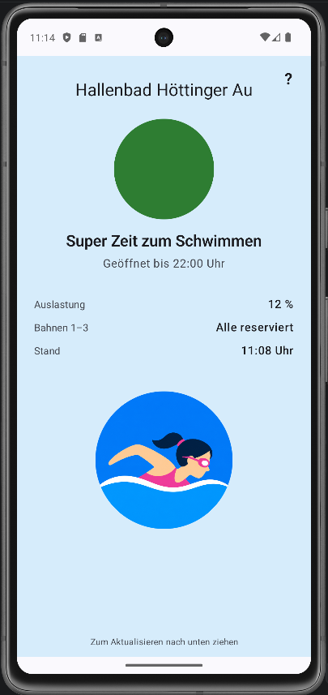

# IKB Pool Monitor

Android app that scrapes three IKB (Innsbrucker Kommunalbetriebe) web sources for the **Hallenbad Höttinger Au** swimming pool and shows a traffic-light recommendation about whether it's a good time to swim.

<p align="center">
  
</p>

## What it does

On launch (and on pull-to-refresh) the app fetches three independent sources in parallel:

| Source | URL | Used for |
|---|---|---|
| IKB pool page | `ikb.at/baeder/hallenbad-sauna-hoettinger-au` | Weekly opening hours (Jsoup-parsed HTML) |
| IKB live occupancy | `sas.ikb.at/ks/baeder_auslastung.aspx?segment=privat` | Current pool occupancy in % |
| Eversports widget | `eversports.at/widget/api/slot` | Lane reservations for the next 30-min slot |

It combines them into a single recommendation using the rules:

| Tier | Color | Rule (open AND …) | Message |
|---|---|---|---|
| **Super** | green | occupancy < 18 % | *Super Zeit zum Schwimmen* |
| **Gut** | light green | occupancy < 30 % | *Gut geeignet zum Schwimmen* |
| **Okay** | yellow | occupancy ≤ 40 % AND lanes 1–3 all reserved | *Noch akzeptabel trotz Reservierung* |
| **Schlecht** | red | occupancy > 40 % OR closed | *Aktuell nicht empfehlenswert* |

If a source fails the others still render, with a small warning at the bottom of the screen — no whole-app crash on partial network failure.

## Tech stack

- Kotlin + Jetpack Compose (Material3), `minSdk` 26, `targetSdk`/`compileSdk` 36
- OkHttp + Jsoup for HTTP + HTML scraping; `kotlinx.serialization` for the JSON API
- `lifecycle-viewmodel-compose` for state, `coroutineScope { async { … } }` for parallel fetching
- Gradle Kotlin DSL with the version catalog in `gradle/libs.versions.toml`
- 58 unit tests (JVM only, no instrumentation), including MockWebServer round-trips and live HTML/JSON fixtures

No backend, no background polling — data refreshes only when the app is opened or pulled-to-refresh.

## Build & run

From the repo root, using the Gradle wrapper:

```
gradlew :app:assembleDebug     # build debug APK
gradlew :app:installDebug      # install on a connected device / emulator
gradlew :app:testDebugUnitTest # run unit tests
```

Or just open the project in Android Studio and press Run.

## Project layout

```
app/src/main/java/com/tfassbender/ikbpool/
├── MainActivity.kt                  hosts Compose content
├── AppContainer.kt / IkbPoolApp.kt  manual DI
├── data/
│   ├── model/                       OpeningHours, Occupancy, LaneReservations, PoolStatus
│   ├── source/                      OpeningHoursScraper, OccupancyScraper, ReservationsScraper
│   └── PoolRepository.kt            parallel fetch + warning aggregation
├── domain/
│   ├── Recommendation.kt
│   └── RecommendationEngine.kt
└── ui/
    ├── PoolUiState.kt
    ├── PoolViewModel.kt
    └── PoolScreen.kt                traffic light, pull-to-refresh, help dialog
```

## Known limitations

- **No summer-closure handling.** The pool page lists a *Sommersperre* range; the app ignores it and shows the regular weekly schedule during that period.
- **No persistent cache.** The last `PoolStatus` lives in the ViewModel only; closing the app discards it.
- **Cloudflare on Eversports.** Direct API calls currently work, but if Cloudflare starts challenging them the reservations source will return 403s. A WebView-based `cf_clearance` cookie warmer would fix that — not implemented because it isn't needed at the moment.

## Credits

Pool data: Innsbrucker Kommunalbetriebe AG (ikb.at) and Eversports (eversports.at). This app reads their public pages; no data is stored or redistributed.
